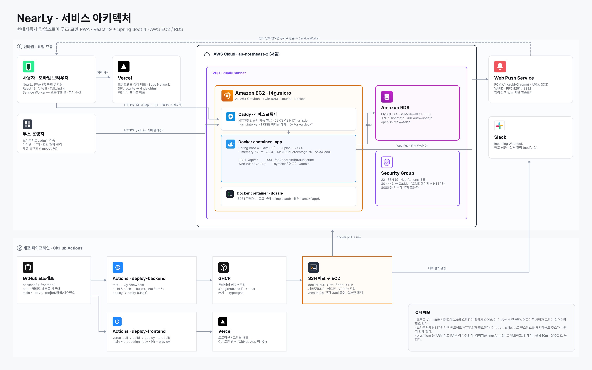

<div align="center">

# NearLy

### 근거리 기반 랜덤 굿즈 교환 서비스

같은 공간에 있는 교환 상대를 찾아, 원하는 굿즈로 바꿉니다.


</div>

---

<br>

## 목차

- [서비스 설명](#서비스-설명)
- [기술 스택](#기술-스택)
- [서비스 아키텍처](#서비스-아키텍처)
- [ERD](#erd)
- [Known Issues](#known-issues)
- [팀 구성](#팀-구성)

<br>

## 서비스 설명

팝업스토어에서 랜덤 굿즈를 산 방문객은 원하는 캐릭터나 상품이 나오지 않거나 중복이 생기면 교환할
상대를 직접 찾아 나섭니다. 같은 현장에 교환이 가능한 사람이 있어도 서로를 알지 못한다는 것이
문제였고, NearLy 는 현장에서 그 교환 가능성을 찾아 연결해 줍니다.

| | 기존 방식 | NearLy |
| --- | --- | --- |
| **상대 탐색** | X 와 오픈채팅, 커뮤니티를 직접 검색 | 원하는 굿즈만 등록하면 자동으로 매칭 |
| **매칭 성공률** | 1:1 이 맞아야만 성사 | 1:1 이 안 되면 세 사람이 순환하는 삼자 교환 |
| **의사 확인** | 모르는 사람에게 직접 말을 걸어야 함 | 등록과 신청으로 교환 의사를 미리 확인 |
| **약속 조율** | 상대가 현장에 있는지 확인하고 시간과 장소를 협의 | 지정 교환장소 고정, 겹치는 시간 자동 확정 |
| **현장에서 만나기** | 사람들 사이에서 상대를 직접 찾음 | 같은 과일 화면을 든 사람을 찾아 식별 |

<br>

### 주요 기능

- **알아서 찾아주는 교환 상대** — 내놓을 굿즈(Have)와 찾는 굿즈(Wanted)를 등록하면 조건이 맞는
  상대를 시스템이 자동으로 찾습니다.
- **둘이 아니어도 셋이서 교환** — 서로 정확히 맞는 상대가 없어도 A 에서 B, B 에서 C, C 에서 A 로
  도는 삼자 교환으로 성사 기회를 넓힙니다.
- **현장에서 바로 교환** — 약속이 확정되면 과일 아이콘 식별 화면을 발급해서, 같은 화면을 든 사람을
  찾아 대면 교환합니다.
- **찔러보기** — 자동 매칭을 기다리지 않고 원하는 상대의 카드에 직접 교환을 신청할 수 있습니다.
- **시간 조율** — 15분 단위로 가능한 시간을 고르면 모두가 되는 가장 빠른 시간으로 확정됩니다.

<br>

### 핵심 플로우


굿즈를 얻은 다음 교환이 성사되기까지를 교환 등록, 교환 매칭, 정해진 시간에 만남, 교환 네 단계로
줄였습니다. 교환이 끝난 뒤에도 아직 찾는 카드가 남아 있으면 자동 매칭이 다시 돕니다.

<br>

### 화면 구성

<table>
  <tr>
    <td align="center" width="33%"></td>
    <td align="center" width="33%"></td>
    <td align="center" width="33%"></td>
  </tr>
  <tr>
    <td align="center"><b>교환 대기존</b><br/><sub>지금 부스에 올라온 카드를 보고<br/>내 카드를 끌어 찔러봅니다</sub></td>
    <td align="center"><b>삼자 매칭 결과</b><br/><sub>세 사람의 카드가 어떻게<br/>이어지는지 보여 줍니다</sub></td>
    <td align="center"><b>현장 식별</b><br/><sub>같은 과일 화면을 든 사람이<br/>교환할 상대입니다</sub></td>
  </tr>
</table>

부스 운영자가 쓰는 어드민은 서버에서 그려 내려보냅니다. 화면과 사용법은
[`docs/admin`](./docs/admin) 에 있습니다.

<br>

## 기술 스택

| 구분 | 사용한 것 |
| --- | --- |
| **프론트엔드** | React 19, TypeScript, Vite 8, Tailwind CSS 4, React Router 8, Motion |
| **PWA** | vite-plugin-pwa, Workbox, Web Push (VAPID) |
| **백엔드** | Java 21, Spring Boot 4, Spring Data JPA, Thymeleaf |
| **데이터베이스** | MySQL 8.4 (로컬은 Docker Compose, 배포는 RDS) |
| **실시간** | SSE (Server-Sent Events), 가상 스레드 |
| **인프라** | AWS EC2 t4g.micro, AWS RDS, Caddy, Docker, GHCR, Vercel |
| **CI/CD** | GitHub Actions, Dozzle, Slack Webhook |

프론트엔드와 백엔드를 한 저장소에서 관리하고, 두 디렉터리는 서로 의존하지 않습니다. 브랜치와 커밋
규칙, 영역별 코딩 컨벤션은 [`CLAUDE.md`](./CLAUDE.md), [`backend/CLAUDE.md`](./backend/CLAUDE.md),
[`frontend/CLAUDE.md`](./frontend/CLAUDE.md) 에 있습니다.

<br>

## 서비스 아키텍처



프론트엔드는 Vercel 에, 백엔드는 EC2 한 대에 올라가 있습니다. 두 오리진이 다르기 때문에 CORS 는
`/api/**` 에만 열어 두었고, 어드민은 서버가 그리는 화면이라 CORS 가 필요하지 않습니다.

화면이 HTTPS 로 서빙되는데 그 안에서 http 주소를 부르면 mixed content 로 막히기 때문에 백엔드에도
HTTPS 가 필요했습니다. Cloudflare 터널은 재시작할 때마다 주소가 바뀌는 것이 걸려서, EC2 앞에
Caddy 를 두고 sslip.io 도메인을 쓰는 쪽을 골랐습니다. 인스턴스를 재시작해도 주소가 그대로입니다.

배포 대상이 t4g.micro 라서 이미지를 `linux/arm64` 로 빌드하고, RAM 이 1 GiB 뿐이라 컨테이너를
640m 으로 묶고 G1GC 를 명시했습니다. main 에 push 하면 테스트와 이미지 빌드를 거쳐 SSH 로 배포한
뒤 `/health` 가 응답할 때까지 확인하고, 결과를 Slack 으로 보냅니다.

<br>

## ERD


한 사용자가 내놓을 카드는 `user_have_items` 에, 찾는 카드는 `user_want_items` 에 수량과 함께
담깁니다. 매칭이 성사되면 `exchanges` 한 건이 생기고 참여자는 `exchange_participants` 로,
누가 누구에게 어떤 카드를 주는지는 `exchange_items` 로 남습니다. 참여자가 둘이면 1:1 교환이고
셋이면 삼자 교환이라, 두 경우를 나누지 않고 같은 구조를 씁니다.

<br>

## Known Issues

3일 동안 만든 것이라 알면서 두고 간 부분이 있습니다.

| 내용 | 지금 상태 |
| --- | --- |
| **로그인이 없습니다** | 브라우저가 만든 UUID 를 `localStorage` 에 저장해 사용자를 구분합니다. 브라우저 데이터를 지우거나 기기를 바꾸면 이전 기록으로 돌아가지 못합니다 |
| **서버를 여러 대로 늘릴 수 없습니다** | SSE 연결을 인스턴스 메모리에 들고 있어서, 두 대로 늘리면 다른 인스턴스에 붙은 사용자에게 이벤트가 가지 않습니다 |
| **스키마 마이그레이션 도구가 없습니다** | `ddl-auto=update` 로 맞추고 있어서 컬럼을 지우거나 이름을 바꾸는 변경은 반영되지 않습니다 |
| **iOS 는 홈 화면에 추가해야 푸시가 옵니다** | 사파리 탭에서는 `PushManager` 자체가 노출되지 않아, 설치하지 않으면 알림을 켤 수 없습니다 |
| [#99](https://github.com/softeerbootcamp-8th/HACKATHON-TEAM1-helloiamoneteamnicetomeetyou/issues/99) 아무도 수락하지 않은 매칭 제안이 남습니다 | 제안이 만료되지 않아 두 사람이 계속 묶여 있습니다 |
| [#34](https://github.com/softeerbootcamp-8th/HACKATHON-TEAM1-helloiamoneteamnicetomeetyou/issues/34) 부스 안 다른 사용자 보유 카드 조회 | 목록 조회 API 가 열려 있는 이슈로 남아 있습니다 |

<br>

## 팀 구성

| 이름 | GitHub | 맡은 것 |
| --- | --- | --- |
| **기승민** | [@KiSeungMin](https://github.com/KiSeungMin) | 어드민 콘솔, 카드 카탈로그와 부스, 프론트엔드 배포 |
| **유승종** | [@bigbell999](https://github.com/bigbell999) | 교환 대기장과 찔러보기, SSE 실시간 연결, 백엔드 배포 |
| **최서지** | [@choiseoji](https://github.com/choiseoji) | 자동 매칭(1:1, 삼자), 매칭 수락과 거절, 알림 |

<br>

## 로컬에서 실행하기

백엔드는 Java 21 이 필요하고 Gradle 은 wrapper 가 받습니다. DB 컨테이너를 먼저 띄웁니다.

```bash
cd backend
docker compose up -d mysql   # localhost:3306 (DB: hackathon)
./gradlew bootRun            # http://localhost:8080
```

프론트엔드는 Node 22 이상과 pnpm 이 필요합니다. pnpm 이 없으면 `corepack enable` 로 켭니다.

```bash
cd frontend
pnpm install
pnpm dev                     # http://localhost:5173
```

`pnpm dev` 는 `/api` 와 `/health` 를 8080 으로 넘겨주기 때문에 백엔드를 같이 띄우면 그대로 붙습니다.
